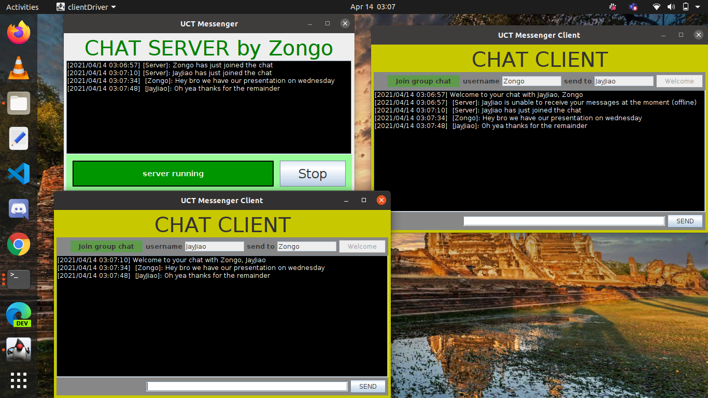

lign="center"> UDP Sockets Messenger App</h1>

<div align="center" >
  
  
  
  
  
</div>

## Table of Contents
* [Features](#features)
* [Libraries Used](#libraries)
* [Project Setup](#license)
* [Future Scope](#license)
## Description 
*This is a chat application created with Java using the User Datagram Protocol (UDP at the transport layer)*
## Live Demo
A live interactive demo can be found [below](https://zmaqutu.github.io/3D-Pathfinding-Visualizer/).


## Features
* **Group Chat** <br>
&emsp;a user can join a global group chat and broadcast messages to all clients in the group chat<br>                                                
&emsp;At the moment the application can serve more than 10 clinets in a group chat.<br>    


* **Retreive older messages** <br>
&emsp;Users can access older messages from previous chats with any client they wish to <br> 

* **Additional features can be found in the report** <br>

### Libraries Used
* Java Abstract Window Toolkit (AWT) + Java Swing
* Java's concurrency library
* Datagram Packets and DatagramSockets from java.net


## Project setup  
To run this project make sure you have downloaded and installed java. Then run the Makefile with the commands[Download and install Java](https://www.oracle.com/java/technologies/javase-downloads.html).
```
make runServer       // Runs a server GUI with instructions to start the server
make runClient      //  Run this command two separate terminals to create an instance of a client
```

## Future Scope
* Send and display all sorts of files including images and videos
* Improve the graphical user interface (more elegant design)
* Add password/security to the application

<p align="center">Made with ❤️ with good ol' vim</p>


